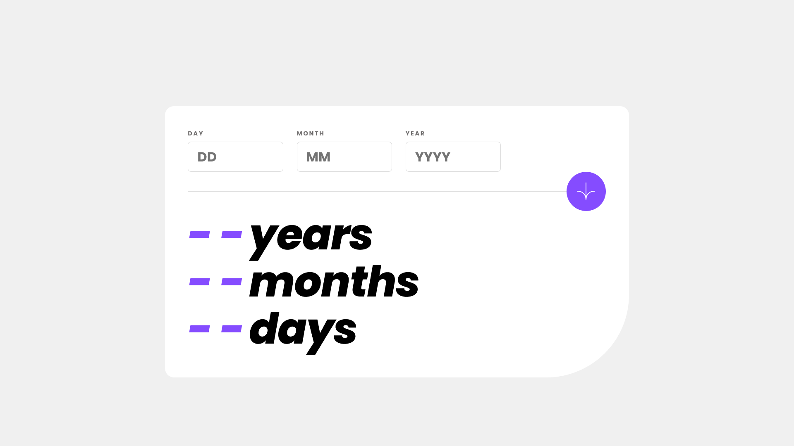

# Frontend Mentor - Age calculator app solution

Esta é uma solução para o [Age calculator app challenge on Frontend Mentor](https://www.frontendmentor.io/challenges/age-calculator-app-dF9DFFpj-Q). Os desafios do Frontend Mentor ajudam você a melhorar suas habilidades de codificação criando projetos realistas. 

## Tabela de conteúdos

- [Visão geral](#visao-geral)
  - [O desafio](#o-desafio)
  - [Captura de tela](#captura-de-tela)
  - [Links](#links)
- [Meu processo](#meu-processo)
  - [Criado com](#criado-com)
  - [O que eu aprendi](#oque-eu-aprendi)
  - [Desenvolvimento contínuo](#desenvolvimento-continuo)
  - [Recursos úteis](#recursos-uteis)
- [Autor](#autor)
- [Agradecimentos](#agradecimentos)

## Visão geral

### O desafio

Os usuários devem ser capazes de:

- Visualizar a idade em anos, meses e dias após enviar uma data válida por meio do formulário
- Receber erros de validação se:
  - Qualquer campo está vazio quando o formulário é enviado
  - O número do dia não está entre 1-31
  - O número do mês não está entre 1-12
  - O ano está no futuro
  - A data é inválida, por ex. 31/04/1991 (abril tem 30 dias)
- Veja o layout ideal para a interface, dependendo do tamanho da tela do dispositivo
- Veja os estados de foco e foco para todos os elementos interativos na página
- **Bônus**: veja os números de idade animados até o número final quando o formulário for enviado

### Captura de tela

### Links

- Solução URL: [Add solution URL here](https://github.com/adriano-wb/age-calculator-app-main)
- Site URL: [Add live site URL here](https://adriano-wb.github.io/age-calculator-app-main/)

## Meu processo
Utilizei HTML5 seguindo os padrões recomendados pela W3C para acessibilidade e uso adequado das tags, atributos e comentários. Em CSS utilizei nomes de classes usando a metodologia BEM(Block Element Modifier) para uma melhor comprenssão facilitando assim a depuração, atualização e reutilização de código. Em JavaScript utilizei a biblioteca jQuery muito utilizada para facilitar a maneira de acessar o DOM(Document Object Model) e no uso de animações.

### Criado com

- marcação HTML5 semântica
- CSS propriedades customizadas
- Flexbox
- CSS Grid
- Mobile-first workflow
- [jQuery](https://jquery.com/) - JS library

### O que eu aprendi

Compreendi um pouco mais sobre técnicas de lógica de programação ao utilizar jQuery para lidar com as datas e manipulações de controle de fluxo. Mais uma vez pude adquirir mais conhecimento que me possibilitou aprimorar minhas habilidades em desenvolvimento web responsivo.

### Desenvolvimento contínuo

Sinto que preciso aprimorar meus conhecimentos numa gestão mais eficiente do código JavaScript, usar classes JS, ou modularização para organização do código para uso futuro ou depurações mais precisas.

## Autor

- Website - [Adriano Portfólio](https://adriano-wb.github.io/PortfolioAdrianoWb/)
- Frontend Mentor - [@adriano-wb](https://www.frontendmentor.io/profile/adriano-wb)
